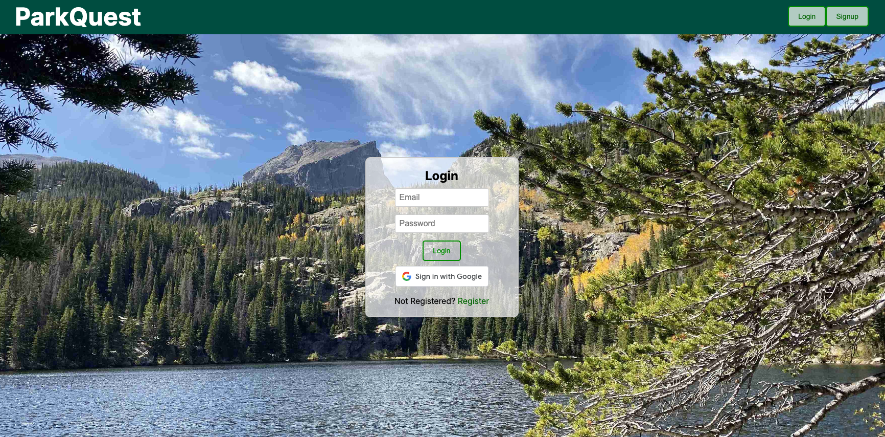
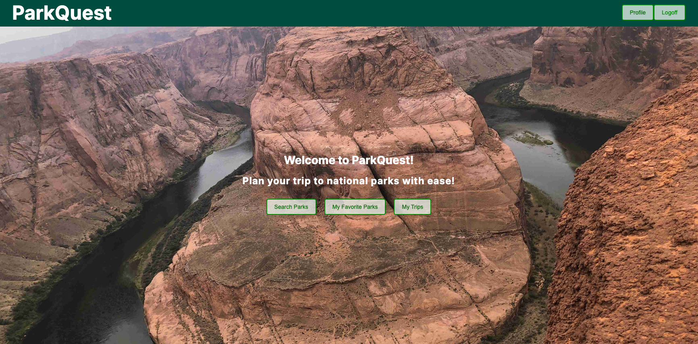
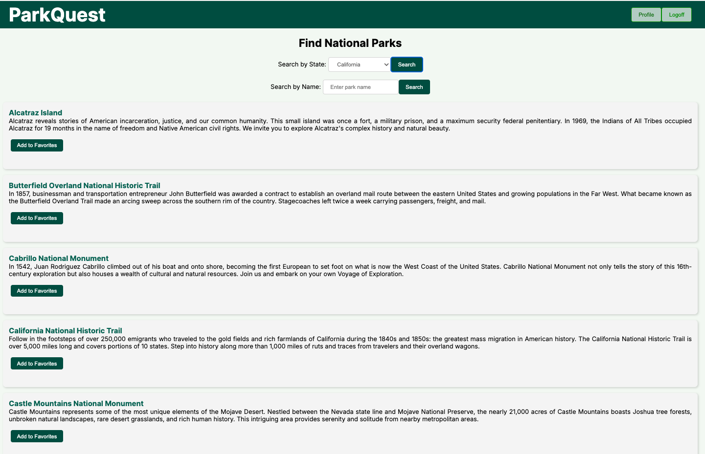
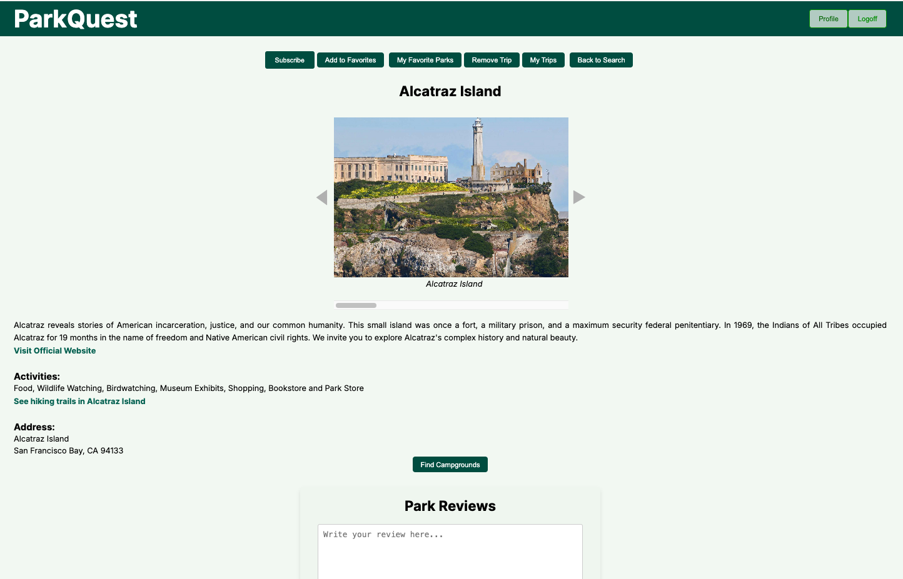
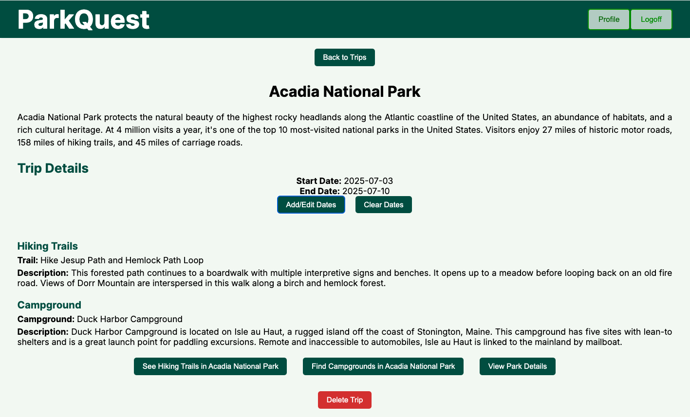

# ParkQuest

#### By Rachel Allen, Sara Bohannon, Sheetal Kharat, Tatiana Snook

## Description
ParkQuest is a user-friendly web application designed to help users explore and plan trips to national parks. It offers intuitive tools for browsing park details, discovering available activities, viewing campground options, and saving favorite parks — making outdoor adventure planning seamless and enjoyable.

## Technologies Used
### Backend
* Java
* Spring Boot
* National Park Service API – fetching national parks and campground information

### Frontend
* React
* Vite – fast development and build tooling
* CSS – styling

## Screenshots

### Login Page


### Home Page


### Parks Search Page


### Park Detail Page


### Trip Detail Page


## Setup & Installation
### Database Setup (MySQL)
1. Create a MySQL Database Schema:
   
   Open your MySQL client (like MySQL Workbench or command-line) and run:
   
   CREATE DATABASE park_quest;
   
   CREATE USER 'your_user_name'@'localhost' IDENTIFIED BY 'your_password';
   
   GRANT ALL PRIVILEGES ON park_quest.* TO 'your_user_name'@'localhost';
   
   FLUSH PRIVILEGES;
3. Configure application.properties
   
   In the src/main/resources/application.properties file, ensure the following settings are added:

   ```
   spring.datasource.url=jdbc:mysql://localhost:3306/park_quest
   spring.datasource.username=your_user_name
   spring.datasource.password=your_password
   spring.jpa.database=MYSQL
   spring.jpa.show-sql=true
   spring.jpa.hibernate.ddl-auto=update
   spring.jpa.properties.hibernate.dialect=org.hibernate.dialect.MySQL8Dialect
   spring.application.name=parkquest-backend
   server.port=8081
   ```
   **Note:** For security in production, never commit real passwords or secrets into your GitHub repo. Consider using environment variables or a secrets manager.
### Backend
1. Clone the repository
   ```
    git clone https://github.com/W-PTWD-April-2024-Liftoff/group-9
   
    cd parkquest-backend
   ```
2. All backend dependencies are managed via Gradle. To install them:
   
   * Open the project in your IDE (e.g., IntelliJ).
   * Gradle will automatically download all required libraries.
   * Or run the following in your terminal:
      ```
      ./gradlew build
      ```
3. Set up environment variables

   * In src/main/resources/application.properties, add:
       ```
       api.key=your_national_parks_service_api_key
       ```
4. Run the Spring Boot application:

    * Open ParkquestBackendApplication.java and click Run.
    * The backend should start at: http://localhost:8081
### Frontend
1. Move to parkquest-frontend folder:
   ```
    cd parkquest-frontend
   ```
2. Install frontend dependencies:
   ```
    npm install
   ```
3. Set up environment variables:
   
   * Create a .env file in the root directory and add:
    ```
       VITE_PARKS_API_KEY=your_national_parks_service_api_key
    ```
4. Run the development server
   ```
       npm run dev
    ```
    * The frontend should start at: http://localhost:5173

## Deployment

## Known Issues

* No known issues at this time.

## Acknowledgements
* National Park Service API for providing access to park and campground data.
* LaunchCode web development program - April 2024 Cohort
